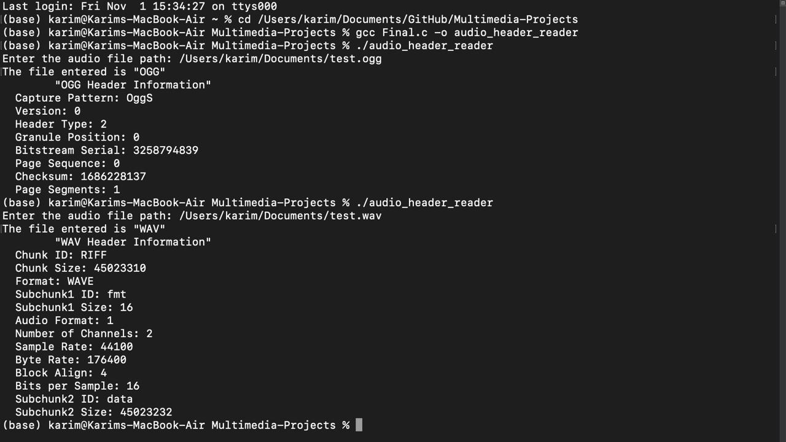

**README**

# Multimedia Project: Audio File Header Reader

This C program reads the header of an audio file and determines if it is a WAV or OGG file. It displays the relevant information for each format.

## Getting Started

To run this program, follow these steps:

1. Clone or download the project from the GitHub repository: https://github.com/KarimSIM2024/Multimedia-Projects-main.git
2. Open a terminal or command prompt and navigate to the project directory.
3. Compile the program using the following command:
   ```
   gcc Final.c -o audio_header_reader
   ```
4. Run the compiled program by executing the following command:
   ```
   ./audio_header_reader
   ```

## Usage

When you run the program, it will prompt you to enter the path of the audio file you want to analyze.

The program will then read the first 44 bytes of the file and determine if it is a WAV or OGG file. It will display the relevant information for each format, such as chunk ID, chunk size, format, sample rate, etc.


## Test Output

Here is an example of the program's output when analyzing a WAV & an OGG file:



## Additional Information
This program uses helper functions to convert bytes to little-endian integers and long integers. The `displayWavHeader` function displays the information specific to WAV files, while the `displayOggHeader` function displays the information specific to OGG files.

Please note that this program only reads the first 44 bytes of the audio file. If you need to analyze the entire file, you may need to modify the code accordingly.
